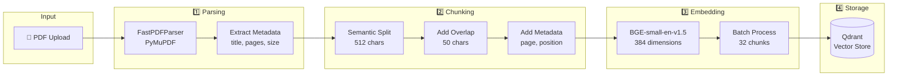
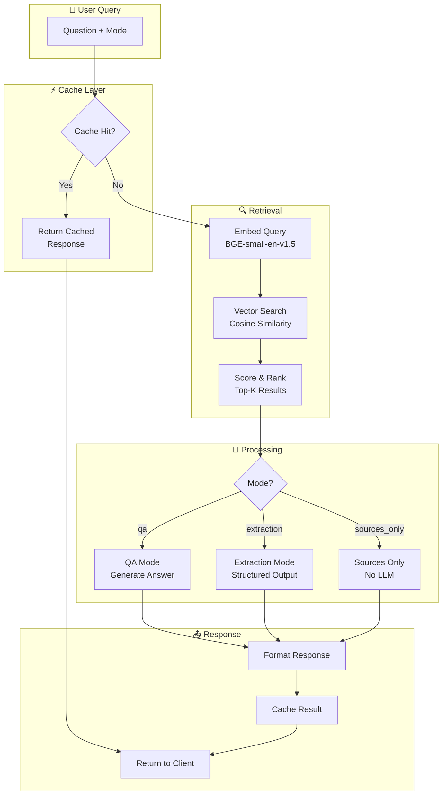
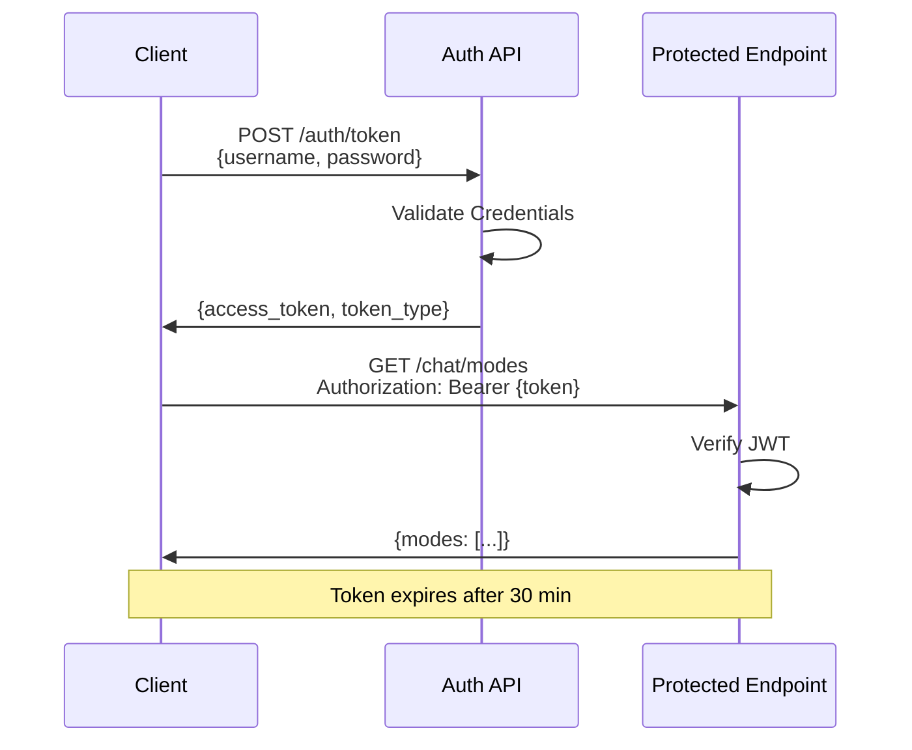
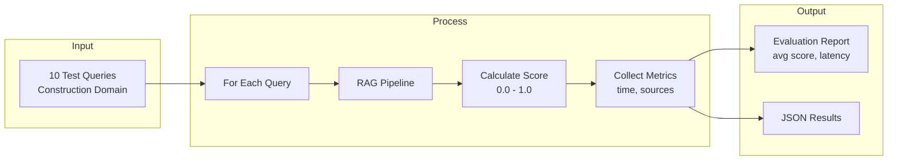
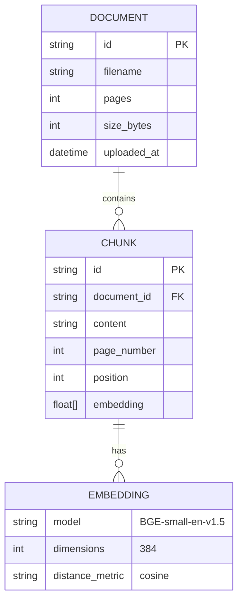
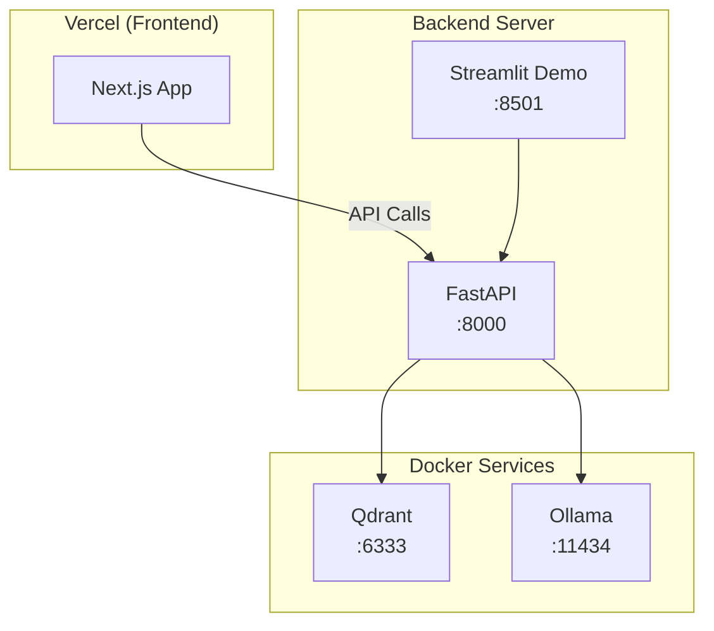

# Project Brain - System Architecture

## High-Level Overview

```mermaid
flowchart TB
    subgraph Client["🖥️ Client Layer"]
        UI[React/Next.js Frontend]
        Demo[Streamlit Demo]
        CLI[CLI Tools]
    end
    
    subgraph API["�� API Gateway"]
        Auth[JWT Authentication]
        Routes[FastAPI Routes]
    end
    
    subgraph Services["⚙️ Core Services"]
        Parser[PDF Parser<br/>PyMuPDF ~30 pg/s]
        Chunker[Smart Chunker<br/>Semantic + Overlap]
        Embeddings[Embedding Service<br/>BGE-small-en-v1.5]
        RAG[RAG Pipeline<br/>+ Caching]
        Extraction[Structured Extractor]
        Eval[Evaluation Harness]
    end
    
    subgraph Storage["💾 Data Layer"]
        Qdrant[(Qdrant Vector DB<br/>384 dimensions)]
        Cache[(LRU Cache<br/>TTL: 1hr)]
    end
    
    subgraph LLM["🧠 AI Layer"]
        Ollama[Ollama Server<br/>llama3.2:1b]
    end
    
    UI --> Auth
    Demo --> Auth
    CLI --> Auth
    Auth --> Routes
    Routes --> Parser
    Routes --> RAG
    Routes --> Extraction
    Routes --> Eval
    Parser --> Chunker
    Chunker --> Embeddings
    Embeddings --> Qdrant
    RAG --> Qdrant
    RAG --> Cache
    RAG --> Ollama
    Extraction --> RAG
    Eval --> RAG
```

---

## Document Ingestion Pipeline



---

## RAG Query Pipeline



---

## Authentication Flow



---

## Evaluation Harness



---

## Data Models



---

## API Endpoints

```mermaid
flowchart LR
    subgraph Auth["/auth"]
        Token[POST /token]
    end
    
    subgraph Health["/health"]
        HealthCheck[GET /]
    end
    
    subgraph Docs["/documents"]
        Upload[POST /upload]
        SmartIngest[POST /smart-ingest]
        List[GET /]
        Delete[DELETE /{id}]
    end
    
    subgraph Chat["/chat"]
        Query[POST /]
        Modes[GET /modes]
    end
    
    subgraph Eval["/evaluation"]
        Run[POST /run]
    end
```

---

## Technology Stack

| Layer | Technology | Purpose |
|-------|------------|---------|
| **API** | FastAPI + Pydantic | REST endpoints, validation |
| **Auth** | JWT (python-jose) | Token-based authentication |
| **PDF** | PyMuPDF (fitz) | Fast PDF parsing (~30 pg/s) |
| **Embeddings** | fastembed BGE-small | 384-dim dense vectors |
| **Vector DB** | Qdrant v1.12.1 | Vector storage & search |
| **LLM** | Ollama llama3.2:1b | Local inference |
| **Cache** | Custom LRU + TTL | Response caching |
| **Testing** | pytest | 40 tests, ~4.7s |
| **Demo UI** | Streamlit | Interactive testing |

---

## Performance Characteristics

| Metric | Value | Notes |
|--------|-------|-------|
| PDF Parsing | ~30 pages/sec | PyMuPDF optimized |
| Embedding | ~100 chunks/sec | Batch size 32 |
| Vector Search | <50ms | Qdrant HNSW index |
| LLM Response | 1-3s | Depends on query |
| Cache Hit | <10ms | LRU with 1hr TTL |
| Full Query E2E | 1-4s | Cold / warm |

---

## Deployment Architecture


